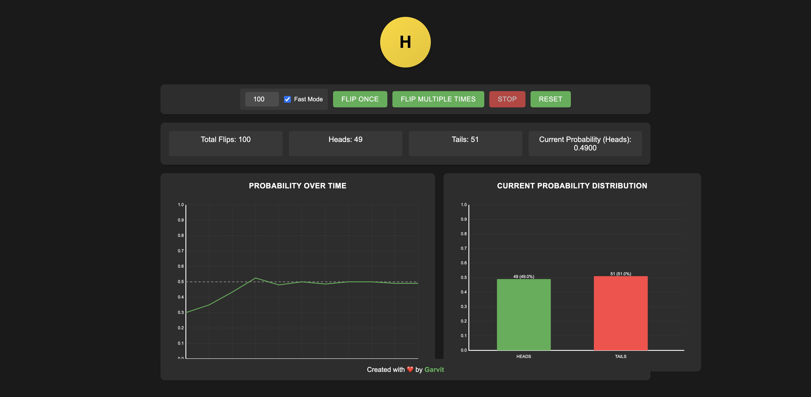
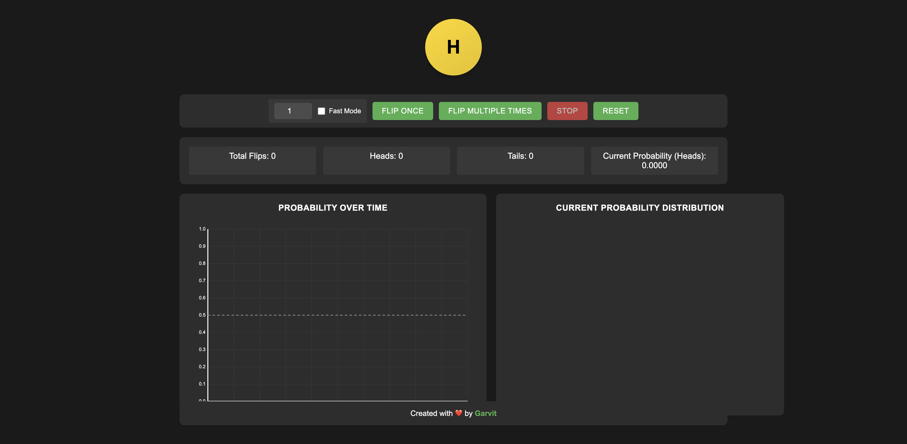
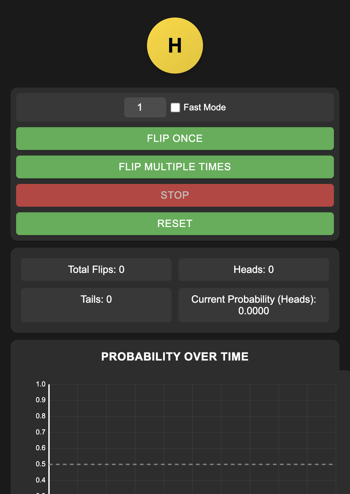

# 🎲 Coin Flip Simulator

A beautiful, interactive coin flip simulator with real-time probability visualization and statistics.



## ✨ Features

- 🎯 Single and multiple coin flips
- 📊 Real-time probability graphs
- ⚡ Fast mode for quick simulations
- 📱 Fully responsive design
- 📈 Dynamic statistics tracking
- 🎨 Beautiful dark theme UI

## 🚀 Live Demo

Try it out: [Coin Flip Simulator](https://garvitofficial.github.io/visualizeFlipTheCoin)

## 🛠️ Technologies Used

- HTML5
- CSS3
- JavaScript (Vanilla)
- HTML5 Canvas for graphs

## 📖 How to Use

1. Click "Flip Once" for a single coin flip
2. Enter a number and click "Flip Multiple Times" for multiple flips
3. Toggle "Fast Mode" for quicker animations
4. Use the "Stop" button to halt multiple flips
5. "Reset" to start fresh

The graphs show:
- Line Graph: Probability of heads over time
- Bar Graph: Current distribution of heads vs tails

## 🖥️ Local Development

1. Clone the repository:
```bash
git clone https://github.com/garvitOfficial/visualizeFlipTheCoin.git
```

2. Open `index.html` in your browser

That's it! No build process or dependencies required.

## 📸 Screenshots

### Desktop View


### Mobile View


## 📄 License

MIT License with Attribution

Copyright (c) 2025 Garvit

Permission is hereby granted, free of charge, to any person obtaining a copy of this software and associated documentation files (the "Software"), to deal in the Software without restriction, including without limitation the rights to use, copy, modify, merge, publish, distribute, sublicense, and/or sell copies of the Software, and to permit persons to whom the Software is furnished to do so, subject to the following conditions:

1. The above copyright notice and this permission notice shall be included in all copies or substantial portions of the Software.
2. Attribution must be given to the original author (Garvit) in any projects that use this code.

THE SOFTWARE IS PROVIDED "AS IS", WITHOUT WARRANTY OF ANY KIND, EXPRESS OR IMPLIED, INCLUDING BUT NOT LIMITED TO THE WARRANTIES OF MERCHANTABILITY, FITNESS FOR A PARTICULAR PURPOSE AND NONINFRINGEMENT. IN NO EVENT SHALL THE AUTHORS OR COPYRIGHT HOLDERS BE LIABLE FOR ANY CLAIM, DAMAGES OR OTHER LIABILITY, WHETHER IN AN ACTION OF CONTRACT, TORT OR OTHERWISE, ARISING FROM, OUT OF OR IN CONNECTION WITH THE SOFTWARE OR THE USE OR OTHER DEALINGS IN THE SOFTWARE.

## 🤝 Contributing

Contributions are welcome! Please feel free to submit a Pull Request.

## 🙏 Credits

Created with ❤️ by [Garvit](https://github.com/garvitOfficial)
